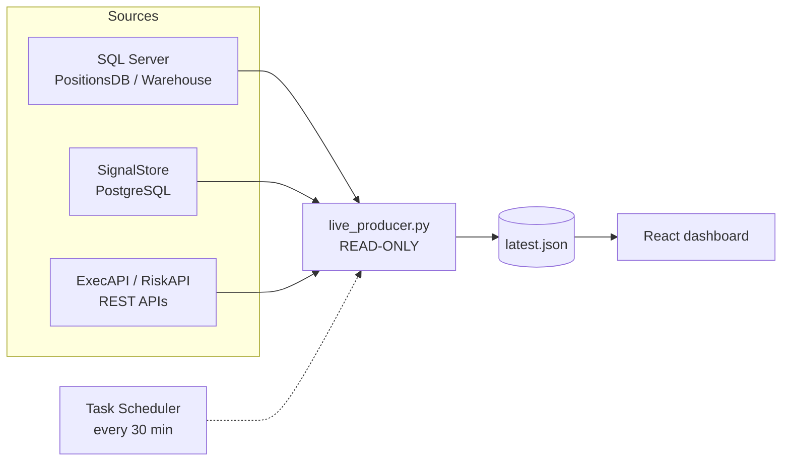

# IGS Daily Monitor

A read-only, self-refreshing dashboard for an algo trading desk. A Python
producer reads the desk's live pipeline sources every 30 minutes and renders
slippage, risk alerts, z-scores, stop-loss watch, price/cost drift and exposure
as a single calm view.

**Live demo (sample data):** [igs-daily-monitor.vercel.app](https://igs-daily-monitor.vercel.app)


> Read-only by design. It never writes to a database, never sends email, and
> never deploys anything — it only *reads* what the pipeline can already compute
> and renders it.

## About this public version

I built this during a software-engineering internship on a quantitative trading
desk, where it ran against live production infrastructure. This public version
is the same codebase with the proprietary parts factored out:

- **The desk's production compute modules are not included.** In production, a
  set of internal batch scripts computed slippage, risk alerts and z-scores from
  live positions; the producer here discovers and calls them dynamically. The
  interface (`live_producer.py`, the payload contract, the tests against it)
  is all here — the desk-owned compute code is not.
- **Source names are genericized.** In production the producer connected to two
  SQL Server databases, a PostgreSQL signal store, and two internal REST APIs
  over VPN. The connection architecture — env-var driven URL resolver, source
  health doctor, live/offline gating — is fully intact; only the internal names
  and hosts were replaced (`PositionsDB`, `Warehouse`, `SignalStore`,
  `ExecAPI`, `RiskAPI`).
- **Sample data is fully synthetic.** Every symbol, company and book label in
  the bundled sample payload is fictional. The shape of the data mirrors what
  the desk saw every morning; the contents do not.

Everything else — the producer/contract/validator pipeline, the scheduler
integration, the React dashboard, and the 52-test pytest suite — is exactly
what ran on the desk.

## What it does

A Python producer computes each section and writes a single strict
`latest.json`. A React dashboard reads that file and shows:

- **Overview** — the day at a glance.
- **Slippage** — per-algo slippage summary.
- **Alerts / Risk** — the risk alert matrix and z-scores.
- **Price / Cost drift** — holdings ranked by drift.
- **Exposure** — top exposures.

Everything on screen is presentation-only: counts, sums, averages and top-N
rankings. No new analytics are invented in the browser.

## Architecture



Design decisions that mattered in production:

- **Strict payload contract.** The producer emits one validated `latest.json`;
  the browser renders it verbatim. A schema validator sits between them, so a
  bad producer run can never half-render.
- **Refuse-to-default safety gates.** Live mode requires an explicit
  environment (`IGS_ENV`), a master switch (`IGS_ALLOW_LIVE=1`) *and* a
  `--confirm-live` flag. Anything less falls back to sample data instead of
  touching production.
- **Source doctor.** A preflight probe checks every configured source
  (connectivity, auth, driver) and reports per-source diagnoses instead of
  letting the producer die mid-run.
- **Last-known-good publishing.** A failed refresh never blanks the dashboard;
  the previous good payload stays up and the staleness is surfaced honestly.

## Quickstart — sample mode (no credentials, any OS)

```bash
pip install -r dashboard_adapter/requirements.txt

# emit the bundled synthetic payload
python dashboard_adapter/build_dashboard_payload.py --mode sample \
  --output igs-daily-monitor/public/data/latest.json

# run the dashboard
cd igs-daily-monitor
npm install
npm run dev        # http://localhost:5173
```

The dashboard also ships with a bundled sample fallback, so `npm run dev` alone
shows a working (amber-flagged) view even without the Python step.

## Production deployment (Windows, live sources)

This is how it ran on the desk — kept here to document the operational design:

```bat
REM 1. one-time setup: venv + Python deps + build the dashboard
scripts\windows\setup.bat

REM 2. configure credentials as environment variables
REM    See config\.env.example for the variable NAMES (never commit values).

REM 3. generate a fresh latest.json
scripts\windows\run_once.bat

REM 4. serve the dashboard (http://localhost:4173)
scripts\windows\serve_dashboard.bat

REM 5. keep it fresh: run every 30 minutes (Administrator prompt)
scripts\windows\install_scheduler.bat
```

The 30-minute refresh has two halves: the browser re-fetches `latest.json` on a
timer (nothing to install), and Windows Task Scheduler re-runs the producer via
`install_scheduler.bat`. Skip the second half and the page politely re-fetches
the same stale file forever.

## Configuration

All connections are environment-variable driven — full list with comments in
`config/.env.example` (variable names only, no values, ever).

| Variable | Purpose |
| --- | --- |
| `IGS_ENV` | Environment selector: `prod` / `altprod` / `stage` / `dev`. |
| `IGS_ALLOW_LIVE` | Must be `1` (with `--confirm-live`) to read live sources. |
| `IGS_POSITIONSDB_URL` / `IGS_WAREHOUSE_URL` | SQL Server SQLAlchemy URLs. |
| `IGS_TIMESERIESDB_URL` / `IGS_REFDB_URL` | Additional SQL Server URLs. |
| `IGS_SIGNALSTORE_URL` (or `IGS_SIGNALSTORE_*` parts) | Signal store PostgreSQL connection. |
| `IGS_EXECAPI_BASE_URL` / `_USER` / `_PASSWORD` | Execution REST API (HTTP Basic). |
| `IGS_RISKAPI_BASE_URL` / `_USER` / `_PASSWORD` | Risk REST API (falls back to ExecAPI creds). |
| `IGS_MARKET_*` | Market timezone and open/close window. |

The resolver refuses `VITE_*` variables for anything secret — nothing
credential-shaped can ever leak into the browser bundle.

## Tests

```bash
python -m pytest tests/ -q     # 52 passed, 8 skipped
```

The suite covers the URL resolver, the source doctor, payload contract
validation, publish/finalize behaviour, producer regressions and the
time-window logic. The skipped tests exercise the proprietary producer tree
and skip themselves cleanly when it is absent (as in this public repo).

## Project structure

```
igs-daily-monitor/
├─ dashboard_adapter/       # read-only producer + payload exporter (Python)
├─ igs-daily-monitor/       # React + Vite + TypeScript dashboard
├─ tests/                   # pytest suite
├─ scripts/windows/         # setup / run_once / serve / (un)install_scheduler
├─ config/.env.example      # variable names only (no values)
└─ requirements.txt
```

## Security

- **Names-only config.** `config/.env.example` documents variable names; real
  values are supplied out-of-band and never committed.
- **Secrets never in git.** `.gitignore` excludes `*.cfg`, `.env*` (except
  `.env.example`), tokens and keys. The resolver blocks `VITE_*` secrets.
- **Read-only.** No database writes, no email, no deploys.
- **Synthetic data only.** All sample symbols, companies and books are fictional.
